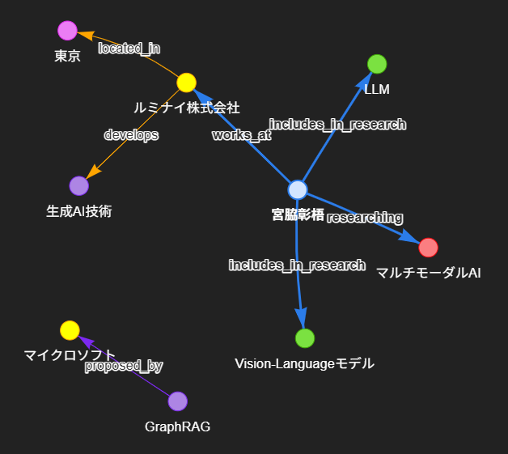

# 🕸️ Minimal GraphRAG Visualizer

**テキストデータを「ナレッジグラフ」として構造化・可視化する、最小構成のGraphRAG実装です。**

LangChainとNetworkXを使用し、非構造化テキストから「エンティティ（Node）」と「関係性（Edge）」を抽出。Pyvisを用いてインタラクティブなネットワーク図として描画します。

VS CodeやJupyter Notebook上でPyvisを使用する際に発生しやすい「描画エリアが真っ白になる問題」を解決済みのコードです。



## 🚀 特徴

* **LLMによる自動抽出**: `gpt-4o-mini` (OpenAI) を使用して、テキストから知識トリプレットを抽出。
* **インタラクティブな可視化**: ノードをドラッグ＆ドロップで動かせる物理演算付きグラフ。
* **VS Code / Jupyter対応**: セキュリティ制限（IFrameのローカルファイルブロック）をData URIスキームで回避し、確実に表示。
* **Pydantic v2対応**: LangChainのバージョン更新に伴う互換性の問題を解決済み。

## 📦 必要要件 (Requirements)

* Python 3.10+
* OpenAI API Key

## 🛠️ インストール (Installation)

リポジトリをクローンし、必要なライブラリをインストールします。

```bash
pip install langchain langchain-openai networkx pyvis pydantic python-dotenv ipython

```

## ⚙️ 設定 (Configuration)

ルートディレクトリに `.env` ファイルを作成し、OpenAIのAPIキーを設定してください。

```ini
OPENAI_API_KEY=sk-your-api-key-here...

```

## 📖 使い方 (Usage)

Jupyter Notebook (`.ipynb`) または Pythonスクリプト (`.py`) として実行可能です。

1. `sample_text` 変数に、分析したいテキストを入力します。
2. コードを実行します。
3. LLMがエンティティ抽出を行い、HTMLファイル (`knowledge_graph.html`) が生成されます。
4. ノートブック上にグラフが表示されます。

### サンプルコードのポイント

```python
# VS CodeなどのNotebook環境でグラフが表示されない問題を回避するための処理
# HTMLの中身を文字列として読み込み、Data URIとしてIFrameに埋め込みます
import urllib.parse
from IPython.display import display, IFrame

with open(html_file, "r", encoding="utf-8") as f:
    html_string = f.read()

html_encoded = urllib.parse.quote(html_string)
display(IFrame(src=f"data:text/html;charset=utf-8,{html_encoded}", width="100%", height="650px"))

```

## 🧩 技術スタック

* [LangChain](https://www.langchain.com/): LLMオーケストレーション
* [NetworkX](https://networkx.org/): グラフ構造の構築・操作
* [Pyvis](https://pyvis.readthedocs.io/): ネットワークグラフの可視化
* [OpenAI API](https://openai.com/): エンティティ抽出 (`gpt-4o-mini` 推奨)
