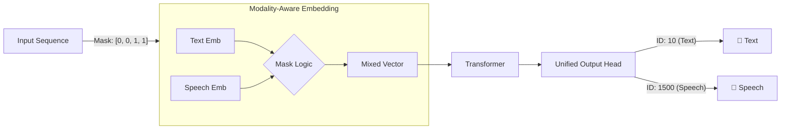

# 🗣️ Runnable Spirit LM Concept (PyTorch)

Meta FAIRが発表した **[Spirit LM: Interleaving Text and Speech](https://arxiv.org/abs/2402.05755)** のアーキテクチャを理解するための、最小限のPyTorch実装（Concept Code）です。

巨大な学習済みモデルをダウンロードすることなく、**「テキストと音声トークンを混ぜて（Interleave）、単一のTransformerで処理する仕組み」** をコードレベルで確認・実行できます。

## 🧩 これは何？

Spirit LMの核心である以下の機能を実装した「動くスケルトンコード」です。

1. **Modality-Aware Embedding**: マスク(`0=Text`, `1=Speech`)を使って、テキスト用埋め込みと音声用埋め込みを動的にブレンドする計算グラフ。
2. **Unified Output Head**: テキスト語彙と音声語彙（HuBERT Unit）を合算した出力層を持ち、モデルが自律的に「次は喋るか、書くか」を決定できる構造。
3. **Mixed-Modal Generation**: テキストと音声が混在したシーケンスを入力し、続きを自己回帰的に生成するループ。

> **⚠️ 注意**: このコードはアーキテクチャのデモであり、**学習済みの重み（Weights）は含まれていません**。そのため、生成されるテキストや音声IDはランダム（デタラメ）です。モデルの内部挙動（Forward Pass / Generation Loop）の理解を目的としています。

## 🚀 クイックスタート

### 必要要件

* Python 3.x
* PyTorch

### インストール

```bash
pip install torch

```

## 🛠️ アーキテクチャの解説

この実装の核となるのは `RunnableSpiritLM` クラス内の `forward` メソッドです。

### 1. トークンのインターリーブ (Interleaving)

Spirit LMは、テキストと音声を別々のモデルで処理せず、1つのシーケンスとして扱います。



### 2. コードのポイント

#### Embeddingの動的切り替え

`if`文で分岐させるのではなく、マスクを用いた行列演算によって計算グラフを維持したまま埋め込みを切り替えています。

```python
# forwardメソッド内
# mask_expanded: 0.0 (Text) or 1.0 (Speech)
x = t_emb * (1 - mask_expanded) + s_emb * mask_expanded

```

#### 単一の出力層 (Unified Head)

出力層は `Text Vocab Size + Speech Vocab Size` の大きさを持っています。
推論時、モデルは全語彙の中から確率的に次を選択します。

* IDが `0 ~ 999` の範囲 → **テキスト** としてデコード
* IDが `1000 ~` の範囲 → **音声トークン** としてデコード

## 📊 実行結果の例

実行すると、以下のようにテキストと音声が混ざり合った生成ログが出力されます。（※未学習のため内容はランダムです）

```text
✅ モデル構築完了
初期入力: [10, 20, 5, 6, 7]
初期マスク: [0, 0, 1, 1, 1] (0=Text, 1=Speech)

--- Spirit LM 推論ループ ---
--- 生成開始 (初期入力長: 5) ---
生成: 🎵 Speech | Unit:355
生成: 📝 Text   | ID:254
生成: 🎵 Speech | Unit:283
生成: 📝 Text   | ID:368
...

```

エラーなくループが回り、モダリティを行き来していることが確認できます。これがSpirit LMの「脳の血管」にあたる部分です。

## 📚 参考文献

* **Paper**: [Spirit LM: Interleaved Spoken and Written Language Model (arXiv:2402.05755)](https://arxiv.org/abs/2402.05755)
* **Official Repo**: [facebookresearch/spiritlm](https://github.com/facebookresearch/spiritlm)