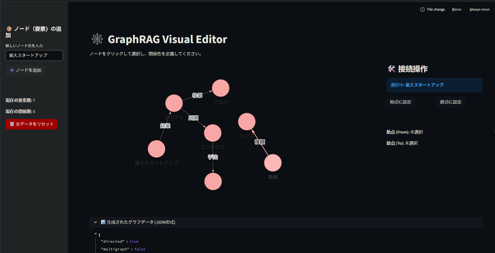

# GraphRAG Visual Editor 🕸️

**GraphRAG Visual Editor** は、ナレッジグラフ（Knowledge Graph）を**非エンジニアでも直感的に構築・編集できる** Streamlit アプリケーションです。

GraphRAG（の実装において、AIが自動生成したグラフの誤りを修正したり、ドメイン知識（暗黙知）を手動で追加したりする **"Human-in-the-loop"** なワークフローを実現するためのプロトタイプです。



## ✨ 特徴

* **No Code Graph Building**: コードを書かずに、GUI上でノード（要素）とエッジ（関係性）を追加できます。
* **Click-to-Connect UI**: ドラッグ操作の代わりに「始点クリック」→「終点クリック」の2ステップを採用し、誤操作の少ない確実な接続操作を実現しました。
* **Physics Visualization**: `streamlit-agraph` による物理演算付きのインタラクティブな可視化。
* **JSON Export**: 作成したグラフデータは NetworkX 互換の JSON 形式で確認・利用可能です。

## 🚀 インストール (Installation)

```bash
pip install streamlit streamlit-agraph networkx

```

## 💻 使い方 (Usage)

以下のコマンドでアプリケーションを起動します。

```bash
streamlit run app.py

```

ブラウザが自動的に立ち上がり（デフォルト: `http://localhost:8501`）、エディタが表示されます。

### 操作フロー

1. **ノードの追加**:
* 左サイドバーに名称（例: "エンジニア", "ルミナイ"）を入力し、「➕ ノードを追加」をクリックします。


2. **始点の選択**:
* 画面上のグラフ内にあるノードをクリックします。
* 右パネルに ID が表示されるので、**「始点に設定」** ボタンを押します（ノードが青色になります）。


3. **終点の選択**:
* 別のノードをクリックします。
* 右パネルで **「終点に設定」** ボタンを押します（ノードが緑色になります）。


4. **接続（エッジ作成）**:
* 右パネルに関係名（例: "所属", "開発"）を入力し、**「🔗 接続する」** をクリックします。


5. **データ確認**:
* 画面下部の「📊 生成されたグラフデータ」を展開すると、JSONデータが取得できます。


## 🛠️ 技術スタック

* **[Streamlit](https://streamlit.io/)**: フロントエンド・バックエンド統合フレームワーク
* **[Streamlit Agraph](https://github.com/ChrisDelClea/streamlit-agraph)**: グラフ可視化コンポーネント
* **[NetworkX](https://networkx.org/)**: グラフ理論・構造操作ライブラリ