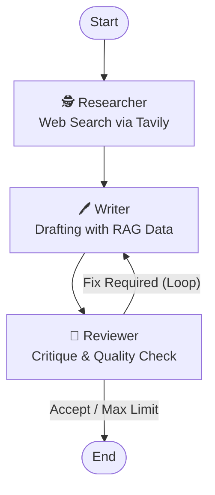

# 🤖 LangGraph AI Editorial Team

**「調査(RAG) → 執筆 → 査読」を自律的に行う、AIマルチエージェント編集部**

LangGraphを用いて構築された、テックブログ記事を自動生成するための実験的プロジェクトです。
3体のAIエージェントが協調し、Web検索で最新情報を収集しながら、品質担保のための修正ループ（査読プロセス）を回します。


## 🏗️ Architecture

このシステムは、以下の3つの専門エージェント（Node）によるステートマシンで構成されています。



1. **🕵️ Researcher**: [Tavily API](https://tavily.com/) を使用してWeb上の最新情報を検索・収集します。
2. **🖊️ Writer**: 調査結果に基づき、Markdown形式で記事を執筆します。査読コメントがある場合は修正を行います。
3. **🧐 Reviewer**: 記事を厳しくチェックします。問題があれば修正指示を出し、Writerに差し戻します（最大修正回数による制限あり）。

## 🚀 Getting Started

### Prerequisites

* Python 3.10+
* **OpenAI API Key**: GPT-4o / GPT-4o-mini を使用します。
* **Tavily API Key**: Web検索のために必要です（[公式サイト](https://tavily.com/)で取得可能）。

### Installation

1. 依存ライブラリをインストールします。
```bash
pip install -r requirements.txt

```


2. 環境変数を設定します。
`.env` ファイルを作成し、APIキーを記述してください。
```env
OPENAI_API_KEY=sk-proj-xxxxxxxx...
TAVILY_API_KEY=tvly-xxxxxxxx...

```


### Usage

以下のコマンドでAI編集部を起動します。

```bash
python main.py

```

実行すると、記事のテーマ入力を求められます。

```text
🚀 AI編集部を起動します...
記事のテーマを入力してください（例：LangGraphの最新機能）: 

```

処理が完了すると、カレントディレクトリに `output_article.md` が生成されます。

## 📂 Project Structure

```text
.
├── main.py           # エントリーポイント（グラフの構築と実行）
├── requirements.txt  # 依存ライブラリ一覧
├── .env              # APIキー設定ファイル（git管理外）
└── src/
    ├── __init__.py
    ├── nodes.py      # 各エージェント（Researcher, Writer, Reviewer）のロジック
    └── state.py      # AgentState（状態管理用の型定義）

```

## ⚠️ Known Issues / Limitations

* **無限ループ防止**: Reviewerが非常に厳格なため、修正が収束しない場合があります。現在は `main.py` 内で `max_revisions = 3` に設定して強制終了させています。
* **Deprecation Warning**: 実行時に `TavilySearchResults` に関するLangChainのWarningが出ることがありますが、動作には影響ありません。

## 👤 Author

**Shogo Miyawaki (Lluminai Inc.)**

* R&D Engineer / Tech Writer
* Specialty: LLM, Multi-Modal AI, Agentic Workflow