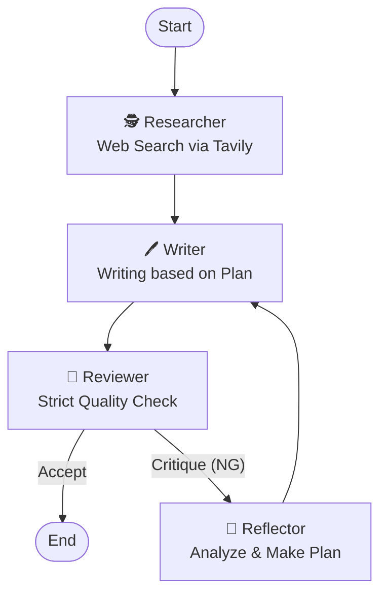

# 🧠 Reflexion AI Writer (LangGraph Demo)

**「指摘されたら、反省して、計画を立ててから直す」** —— Self-Correction（自己修正）機能を搭載した自律型AIライターの実装デモです。


## 📖 Overview

通常のAgentic Workflowでは「執筆 → 査読 → 修正」のループを行いますが、修正方針が曖昧なまま書き直し（Regenerate）を行うと、品質が向上しないままトークンを浪費する傾向があります。

本プロジェクトでは、**Reflexion (Shinn et al., 2023)** の概念を取り入れ、査読でNGが出た場合に「Reflector（反省担当）」が介入します。Reflectorは指摘事項を分析し、「具体的な修正計画（Action Plan）」を策定してからWriterに執筆を依頼します。

## 🏗️ Architecture

LangGraphを用いて、以下のステートマシンを構築しています。



1. **🕵️ Researcher**: [Tavily API](https://tavily.com/) でWeb検索し、コンテキスト情報を収集。
2. **🖊️ Writer**: 記事を執筆。修正時はReflectorの「計画書」に従う。
3. **🧐 Reviewer**: 記事を厳格に査読。「合格(ACCEPT)」か「指摘(Critique)」を出力。
4. **🧠 Reflector (New!)**: Reviewerの指摘を受け、「なぜダメだったか」「次はどう直すべきか」を言語化した修正計画を作成する。

## 🚀 Getting Started

### Prerequisites

* Python 3.10+
* **OpenAI API Key**: GPT-4o 推奨（Reviewer/Reflectorの高い推論能力が必要なため）
* **Tavily API Key**: 最新情報の検索に使用

### Installation


1. Install dependencies:
```bash
pip install -r requirements.txt

```


2. Set up environment variables:
Create a `.env` file in the root directory.
```env
OPENAI_API_KEY=sk-proj-xxxxxxxx...
TAVILY_API_KEY=tvly-xxxxxxxx...

```


### Usage

Run the main script:

```bash
python main.py

```

実行するとテーマの入力を求められます。

```text
🚀 Self-Correction AI Writer 起動...
テーマを入力: (例: 最近のLLMトレンド)

```

処理が完了（またはループ上限に到達）すると、`final_article.md` が生成されます。

## 📂 Project Structure

```text
.
├── main.py           # グラフ定義と実行エントリーポイント
├── requirements.txt  # 依存ライブラリ
├── .env              # APIキー設定
└── src/
    ├── nodes.py      # 各エージェント(Researcher, Writer, Reviewer, Reflector)の実装
    └── state.py      # AgentState定義 (reflectionフィールドを追加)

```

## ⚠️ Known Issues (The "Infinite Loop")

* **Strict Reviewer**: 査読担当（Reviewer）の基準が高く設定されており、またWriterが検索結果にない情報を捏造しないよう制限されているため、**修正ループが収束せず上限（Loop Limit）に達する場合**があります。
* これは仕様です。「AI同士の終わらない議論」をお楽しみください（`main.py` の `revision_count` で上限を変更可能です）。

## 📚 References

* **Original Article**: [Zenn Blog Post Link Here]
* **Paper**: [Reflexion: Language Agents with Verbal Reinforcement Learning](https://arxiv.org/abs/2303.11366)

## 👤 Author

**Shogo Miyawaki (Lluminai Inc.)**

* R&D Engineer / Tech Writer
* Specialty: Agentic Workflow, Multi-Modal AI
