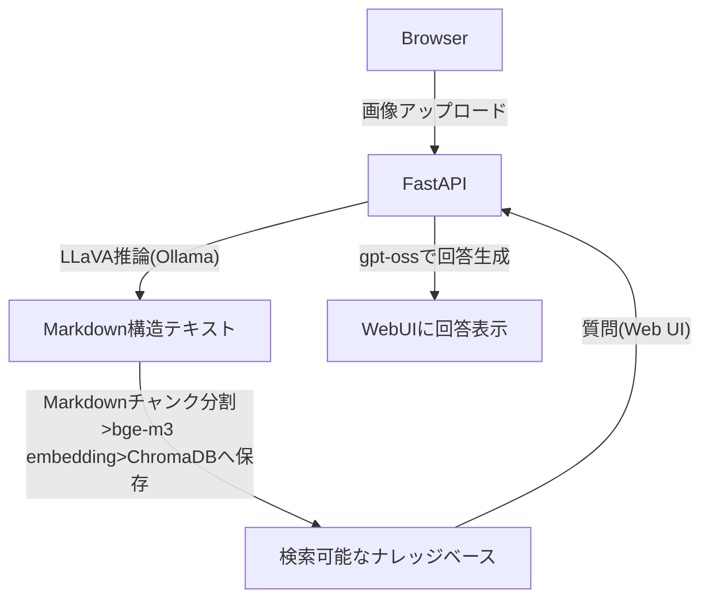

# 📚 Ollama × FastAPI × LLaVA × ChromaDB  
## ローカルだけで動く「画像 → Markdown → RAG検索」マルチモーダル文書解析基盤

このリポジトリは、

**画像ドキュメント（スキャン画像・ホワイトボード写真・スライド等）を  
ローカル環境で解析し、Markdown → ベクトル化 → 検索 → QAまで一気通貫で行う  
“完全ローカル・マルチモーダルRAG基盤”**

の実装です。

クラウドAPI不要・コストゼロで、  
**画像→Markdown構造化（LLaVA）＋ 検索（bge-m3 / ChromaDB）＋ 回答生成（llama3）**  
を FastAPI × Web UI で操作できます。

機密文書を扱う企業・研究室・オンプレ環境に最適です。

---

# 🧩 機能概要（Overview）

本アプリケーションが提供する機能：

### 🎨 1. 画像 → Markdown 自動変換（LLaVA）
- 図・表・レイアウトを Markdown で構造化  
- 見出し / 箇条書き / セクション化も自動生成  
- 画像ドキュメントを「テキスト化して構造を保持」できる

### 🧠 2. Markdown を RAG ナレッジとして登録
- Markdown → チャンク分割（階層構造に基づく）
- bge-m3 で Embedding
- ChromaDB に保存

### 🔍 3. 質問応答（RAG）
- ユーザー質問を Embedding し類似文脈を検索
- gpt-oss が文脈ベースで自然文回答

### 🌐 4. Web UI による一貫操作
- 画像アップロード
- Markdownプレビュー
- インデックス作成
- 質問入力
- 回答＋参照チャンク表示

### アーキテクチャ設計



---

# ⚙️ 使用環境（Environment）

| 項目 | 内容 |
|------|------|
| **VLM** | `llava:13b`（Ollama） |
| **LLM** | `gpt-oss:20b`（Ollama） |
| **Embedding** | `BAAI/bge-m3` |
| **DB** | ChromaDB |
| **Backend** | FastAPI |
| **Frontend** | HTML/CSS/JavaScript |

GPU があれば自動的に高速化されます。

---

# 📂 ディレクトリ構成（Directory Structure）

```

project_root/
│
├── app_full.py          # FastAPI（VLM + RAG API）
├── rag_pipeline.py      # RAGコア（チャンク / Embedding / 検索）
├── ollama_client.py     # LLaVA 呼び出し（画像→Markdown）
│
├── static/
│   └── index.html        # Web UI（画像アップロード + QA）
│
└── README.md

````

---

# 🚀 セットアップ（Setup）

## 1. Python環境の準備

```bash
pip install fastapi uvicorn requests python-multipart chromadb sentence-transformers
````

## 2. Ollamaのインストール

公式サイトよりダウンロード
👉 [https://ollama.com/](https://ollama.com/)

## 3. モデル取得

```bash
ollama pull llava:13b
ollama pull gpt-oss:20b
```

---

# ▶️ 起動方法（Run）

## 1. Ollama を立ち上げる

```bash
ollama serve
```

ログ例：

```
Listening on 127.0.0.1:11434
GPU backend loaded.
```

## 2. FastAPI を起動

```bash
uvicorn app_full:app --reload
```

## 3. Web UI にアクセス

```
http://127.0.0.1:8000
```

---

# 📦 主要ファイル（Main Files）

## `ollama_client.py`

* 画像 → Base64 → LLaVA 推論
* Markdown 構造化出力

## `rag_pipeline.py`

* Markdown チャンク分割
* bge-m3 Embedding
* ChromaDB 登録・検索
* gpt-oss:20b で QA

## `app_full.py`

FastAPI 本体

* `/api/analyze` → 画像 → Markdown → RAG登録
* `/api/query` → 質問応答（RAG）

## `static/index.html`

Web UI

* アップロード
* Markdown 表示
* 質問フォーム
* 回答＋引用文脈を表示

---

# 🧪 動作例（Example）

1. 画像をアップロード
2. Markdown が自動生成
3. 「この図は何を表している？」など質問
4. RAGで回答が返ってくる
5. 参照された文脈（チャンク）も確認可能

---

# 🛠 トラブルシューティング

### ❌ `Connection refused: 11434`

Ollama が起動していません。
→ `ollama serve` を実行。

### ❌ Embedding が重い

→ `bge-small` に変更可能。

### ❌ LLaVA が重い

→ `llava:7b` へ変更。

---

# ⭐ Star いただけると励みになります！

このリポジトリが役に立った場合、
ぜひ 🌟 をお願いします！