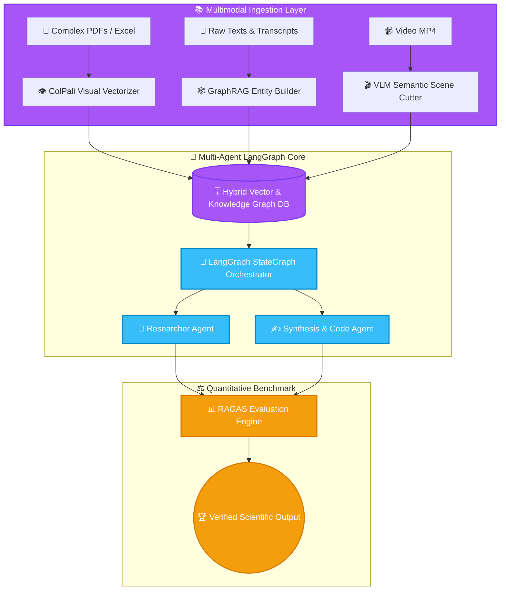

<p align="center">
  
</p>

<h1 align="center">🧠 LLUMINAI — Advanced LLM & Agentic AI Research Lab</h1>

<p align="center">
  <strong>Comprehensive, Reproducible Research Playground for LLM Pretraining, Knowledge Graph RAG, Multi-Agent LangGraph Architectures, & ColPali Visual Retrieval.</strong>
</p>

<p align="center">
  <a href="#-overview">Overview</a> •
  <a href="#-research-modules">Research Modules</a> •
  <a href="#-code-architecture">Code Architecture</a> •
  <a href="#-system-pipeline">System Pipeline</a> •
  <a href="#-project-structure">Structure</a> •
  <a href="#-quick-start">Quick Start</a> •
  <a href="#-license">License</a>
</p>

<p align="center">
  
  
  
  
  
  
</p>

---

## 📌 Overview

**LLUMINAI** is an extensive, reproducible experimental laboratory containing 20+ specialized modules exploring the frontier of Large Language Models and Autonomous AI Agents. Covering everything from scratch transformer pretraining and scaling law dynamics to stateful LangGraph multi-agent coordination, GraphRAG knowledge structures, ColPali vision-language multi-vector retrieval, and quantitative RAGAS evaluation.

---

## ✨ Research Modules & Capabilities

| Module | Primary Focus | Outcome & Real Proof |
| :--- | :--- | :--- |
| 🚀 **LLM Pretraining & Scaling** | Modules 11–13, 16 | Scratch tokenization, causal transformer pretraining loops, and empirical compute scaling analysis |
| 🕸️ **Knowledge Graph & Advanced RAG** | Modules 25, 34, 42, 43 | GraphRAG entity-relationship extraction, Memo-RAG memory hierarchies, and cache-optimized vector search |
| 👁️ **ColPali Visual Document RAG** | Module 34 | Multi-vector patch-level visual embedding for dense charts, tables, and complex PDF layouts |
| 🤖 **Multi-Agent Orchestration** | Modules 5, 6, 30, 36 | Stateful LangGraph multi-agent cyclic graphs with SQLite checkpoints, human-in-the-loop, and tool routing |
| 🎬 **Multimodal VLM & Video Analysis** | Modules 27, 53 | Vision-language keyframe reasoning, automated semantic video cutting, and narrative arc deconstruction |
| ⚖️ **RAGAS Quantitative Evaluation** | Modules 28, 29, 48 | Automated evaluation of faithfulness, answer relevancy, context recall, and reinforcement fine-tuning logs |

---

## 🔬 Code Architecture & Implementation

### 📐 Technical Highlights Across Core Modules
- **`5_2025_11_21_langgraph/main.py`**: Builds stateful `StateGraph(AgentState)` workflows connecting research agents, tool execution nodes (`ToolNode`), and conditional router edges with SQLite-backed thread checkpoints (`SqliteSaver`).
- **`34_2026_1_28_colpali_rag/`**: Implements vision-based multi-vector document retrieval using ColPali / Byaldi architectures, indexing raw PDF page image tokens directly without brittle OCR text extraction.
- **`25_2026_1_7_graphrag/`**: Extracts entity-relation triplets using structured LLM schemas and builds query-time sub-graph communities for global semantic synthesis.
- **`53_2026_3_11_vlm_video_cut/`**: Combines OpenCV frame difference metrics with Vision-Language Models to detect scene boundaries and generate timestamped editing EDL cuts.
- **Container Infrastructure (`Dockerfile`, `docker-compose.yml`)**: Unified PyTorch + CUDA development stack with mounted live volume mapping and automated environment bootstrapping.

---

## 📊 System Pipeline



---

## 📁 Repository Directory Layout

```bash
lluminai/
├── 📁 assets/                 # High-resolution SVG banners
│   └── 🎨 hero.svg
├── 📁 1_2025_11_7_deep_ideation...    # Autonomous research idea generator
├── 📁 5_2025_11_21_langgraph...       # Stateful multi-agent graph workflows
├── 📁 11_2025_12_5_llm_pretraining_1..# Scratch causal transformer training
├── 📁 25_2026_1_7_graphrag...         # Knowledge graph RAG implementation
├── 📁 34_2026_1_28_colpali_rag...     # Multi-vector vision-language RAG
├── 📁 53_2026_3_11_vlm_video_cut...   # Vision-language video segmentation
├── 🐳 Dockerfile & docker-compose.yml # Containerized GPU environment
└── 📄 README.md                       # Complete research documentation
```

---

## 🚀 Quick Start

### 1. Docker Compose (GPU Accelerated)
```bash
# 1. Start GPU-accelerated workspace
docker compose up -d

# 2. Access JupyterLab environment at http://localhost:8888
```

### 2. Standalone Module Execution
```bash
# Navigate to specific experimental module
cd 5_2025_11_21_langgraph
pip install -r requirements.txt
python main.py
```

---

<p align="center">
  Released under the <a href="LICENSE">MIT License</a>. Crafted with ❤️ by <a href="https://github.com/LoNebula">LoNebula</a>
</p>